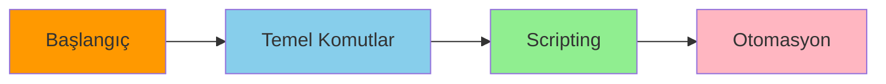
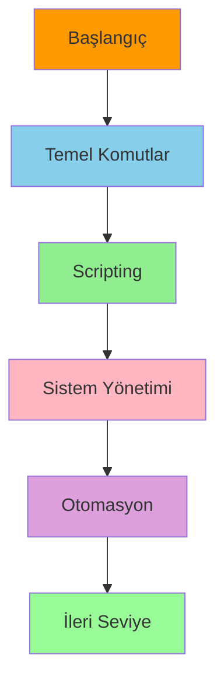

<div align="center">
  
# 🔷 PowerShell Kapsamlı Başvuru Kılavuzu 🔷

[](https://github.com/PowerShell/PowerShell)
[](https://docs.microsoft.com/powershell/)
[](https://code.visualstudio.com/)

### 🚀 Kapsamlı PowerShell Öğrenme ve Başvuru Rehberi
*En güncel PowerShell komutları, best practice'ler ve ipuçları*

-------------------

</div>

## 📑 İçindekiler

<div align="center">

| Temel Konular | Orta Seviye | İleri Seviye |
|:-------------:|:-----------:|:-------------:|
| [🔰 Giriş](#giriş-ve-temel-bilgiler) | [📂 Dosya İşlemleri](#dosya-ve-dizin-işlemleri) | [🔐 Güvenlik](#güvenlik-ve-erişim) |
| [⌨️ Terminal](#powershell-ise-ve-terminal) | [⚙️ Sistem Yönetimi](#sistem-yönetimi) | [🌐 Remoting](#powershell-remoting) |
| [📌 Temel Komutlar](#temel-komutlar-ve-kavramlar) | [🌍 Ağ Yönetimi](#ağ-yönetimi) | [🔄 DSC](#ileri-seviye-konular) |
| [📊 Veri Tipleri](#değişkenler-ve-veri-tipleri) | [📊 Veritabanı](#powershell-ile-veritabanı-işlemleri) | [☁️ Azure](#powershell-ve-azure) |

</div>

-------------------

## 🎯 Hızlı Başlangıç

<div align="center">



</div>

## 🔰 Giriş ve Temel Bilgiler

<table>
<tr>
<th width="50%">Temel Kavramlar</th>
<th width="50%">Örnekler</th>
</tr>
<tr>
<td>

### 📌 PowerShell Nedir?
- Nesne tabanlı otomasyon platformu
- .NET Framework temelli
- Cross-platform desteği
- Güçlü scripting özellikleri

</td>
<td>

```powershell
# Sürüm kontrolü
$PSVersionTable

# Çalışma ortamı
Get-ExecutionPolicy
Set-ExecutionPolicy RemoteSigned
```

</td>
</tr>
</table>

## ⚡ Temel Komutlar ve Kavramlar

<div align="center">

| Komut Kategorisi | 📝 Açıklama | ⌨️ Örnek |
|-----------------|------------|---------|
| **Get** Komutları | Bilgi alma | `Get-Process` |
| **Set** Komutları | Değer atama | `Set-Location` |
| **New** Komutları | Yeni oluşturma | `New-Item` |
| **Remove** Komutları | Silme | `Remove-Item` |

</div>

## 🔄 Pipeline Kullanımı

<div style="background-color: #f6f8fa; padding: 15px; border-radius: 5px;">

```powershell
# 🔹 Temel Pipeline
Get-Process | Sort-Object CPU -Descending | Select-Object -First 5

# 🔸 Gelişmiş Pipeline
Get-Service | 
    Where-Object {$_.Status -eq "Running"} | 
    Select-Object Name, Status
```

</div>

## 📊 Değişkenler ve Veri Tipleri

<div align="center">

| Veri Tipi | 🏷️ Tanım | 📝 Örnek |
|-----------|---------|---------|
| **String** | Metin | `$text = "PowerShell"` |
| **Integer** | Tam sayı | `$num = 42` |
| **Array** | Dizi | `$arr = @(1,2,3)` |
| **Hashtable** | Hash tablosu | `$hash = @{Key="Value"}` |

</div>

## 🔧 Sistem Yönetimi

<table>
<tr>
<th width="33%">Süreç Yönetimi</th>
<th width="33%">Servis Yönetimi</th>
<th width="33%">Registry</th>
</tr>
<tr>
<td>

```powershell
Get-Process
Start-Process
Stop-Process
```

</td>
<td>

```powershell
Get-Service
Start-Service
Stop-Service
```

</td>
<td>

```powershell
Get-ItemProperty
Set-ItemProperty
```

</td>
</tr>
</table>

## 🌐 Ağ Yönetimi

<div style="background-color: #f6f8fa; padding: 15px; border-radius: 5px;">

### 📡 Temel Ağ Komutları

```powershell
# Ağ adaptörleri
Get-NetAdapter

# IP konfigürasyonu
Get-NetIPConfiguration

# Bağlantı testi
Test-NetConnection
```

</div>

## 🔐 Güvenlik ve Erişim

<div align="center">

| 🛡️ Güvenlik Özelliği | 📝 Açıklama | ⚡ Örnek Komut |
|---------------------|------------|--------------|
| Execution Policy | Script çalıştırma politikası | `Set-ExecutionPolicy` |
| Sertifikalar | Dijital imzalar | `Get-ChildItem Cert:\` |
| Şifreleme | Veri güvenliği | `ConvertTo-SecureString` |

</div>

## ☁️ Azure Entegrasyonu

<div style="background-color: #f6f8fa; padding: 15px; border-radius: 5px;">

```powershell
# Azure'a bağlanma
Connect-AzAccount

# Kaynak yönetimi
Get-AzResourceGroup
New-AzResourceGroup
```

</div>

## 📚 Best Practices

<div align="center">

| 📌 Kategori | ✨ Öneriler |
|------------|------------|
| Kod Stili | - Anlamlı değişken isimleri<br>- Düzenli boşluklar<br>- Tutarlı girinti |
| Performans | - ArrayList kullanımı<br>- Paralel işleme<br>- Memory yönetimi |
| Güvenlik | - En az yetki prensibi<br>- Şifreli depolama<br>- Güncel modüller |

</div>

## 🎓 Öğrenme Yol Haritası

<div align="center">



</div>

## 🛠️ Faydalı Araçlar ve Kaynaklar

<div align="center">

| 🔧 Araç | 📝 Açıklama | 🔗 Link |
|---------|------------|---------|
| VS Code | Modern editör | [İndir](https://code.visualstudio.com/) |
| PowerShell ISE | Entegre geliştirme ortamı | Windows içinde |
| Pester | Test framework | [GitHub](https://github.com/pester/Pester) |

</div>

-------------------

<div align="center">

### 📢 Katkıda Bulunma
Bu rehberi geliştirmek için önerilerinizi bekliyoruz!

### 📜 Lisans
Bu rehber MIT lisansı altında dağıtılmaktadır.

</div>
